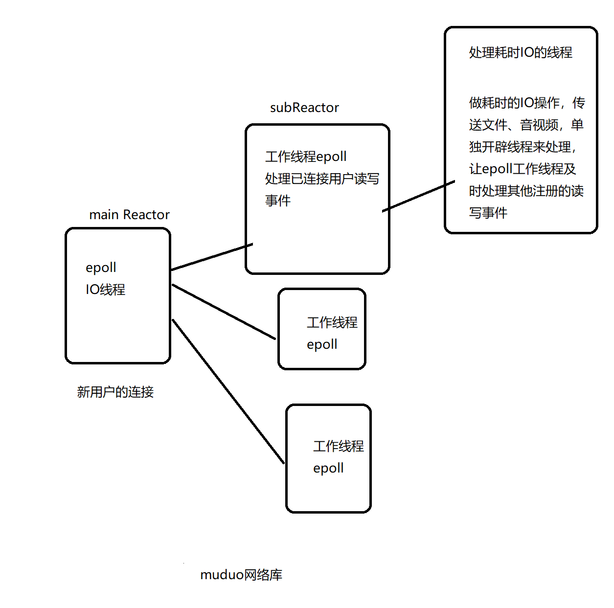

# json测试

JSON for Modern C++
# boost测试
https://blog.csdn.net/QIANGWEIYUAN/article/details/88792874

# muduo测试
https://blog.csdn.net/QIANGWEIYUAN/article/details/89023980



# cmake测试


```
# g++ -o server -g muduo_server.cpp xxx.cpp -l/usr/include -L/usr/lib -lmuduo_net -lmuduo_base -lpthread

cmake_minimum_required(VERSION 3.0)
project(main)

# 配置编译选项 -O2 -g
set(CMAKE_CXX_FLAGS ${CMAKE_CXX_FLAGS} -g)

# 配置头文件搜索路径 -l/usr/include
# include_directories()

# 配置库文件搜索路径 -l/usr/lib
# link_directories()

# 设置需要编译的源文件列表
set(SRC_LIST muduo_server.cpp)

# 把.指定路径下的所有源文件名字放入变量SRC_LIST里面
# aux_source_directory(. SRC_LIST)

add_executable(server ${SRC_LIST})

# server需要链接库文件
target_link_libraries(server muduo_net muduo_base pthread)
```


# mysql测试

修改密码

https://blog.csdn.net/qq_26164609/article/details/106881079

User表

| 字段名   | 字段类型                  | 字段说明     | 约束                        |
| -------- | ------------------------- | ------------ | --------------------------- |
| id       | INT                       | 用户id       | PRIMARY KEY, AUTO_INCREMENT |
| name     | VARCHAR                   | 用户名       | NOT NULL, UNIQUE            |
| password | VARCHAR                   | 用户密码     | NOT NULL                    |
| state    | ENUM('online', 'offline') | 当前登录状态 | DEFAULT 'offline'           |

Friend表

| 字段名   | 字段类型 | 字段说明 | 约束               |
| -------- | -------- | -------- | ------------------ |
| userid   | INT      | 用户id   | NOT NULL, 联合主键 |
| friendid | INT      | 好友id   | NOT NULL, 联合主键 |

AllGroup表

| 字段名    | 字段类型     | 字段说明   | 约束                       |
| --------- | ------------ | ---------- | -------------------------- |
| id        | INT          | 组id       | PRIMARY KEY, AUT_INCREMENT |
| groupname | VARCHAR(50)  | 组名称     | NOT NULL                   |
| groupdesc | VARCHAR(200) | 组功能描述 | DEFAULT ''                 |

GroupUser表

| 字段名    | 字段类型                  | 字段说明 | 约束               |
| --------- | ------------------------- | -------- | ------------------ |
| groupid   | INT                       | 组id     | NOT NULL, 联合主键 |
| userid    | INT                       | 组员id   | NOT NULL, 联合主键 |
| grouprole | ENUM('creator', 'normal') | 组内角色 | DEFAULT 'normal'   |

OfflineMessage表

| 字段名  | 字段类型     | 字段说明             | 约束     |
| ------- | ------------ | -------------------- | -------- |
| userid  | INT          | 用户id               | NOT NULL |
| message | VARCHAR(500) | 离线消息(json字符串) | NOT NULL |


# 改善文件组成

bin: 可执行文件

lib: 中间库文件

include: 头文件

src: 源文件

build: 编译过程产生的临时中间文件

example: 示例代码

thridparty: 第三方源码文件

CMakeLists.txt

autobuild.sh: 一键编译

# 遇到的问题
## 一（已解决）
Failed to connect to github.com port 443: 拒绝连接
### 方法一（无效）
```
git config --global http.proxy
git config --global https.proxy
```
发现有代理，需要关闭
```
unset http_proxy
unset https_proxy
```

### 方法二（有效）
发现虚拟机无法登陆github，给虚拟机开启vpn
https://steemit.com/ubutnu/@yanwu/vmware-ubuntu-shadowsocks

## 二（已解决）
GnuTLS recv error (-54): Error in the pull function.

### 方法一（有效）
可能是vscode bug，如果git的图形界面远程库选择时直接通过github仓库选择不行，要通过url选择


## 三

```
add_subdirectory(src)
# add_subdirectory(test)
```

无法同时执行，必须注释掉其一

## 四（已解决）

git clone太慢，但是难以和vpn配合使用，vpn有时全局有时绕过大陆

直接下载zip压缩包后Xftp传输

## 五（未解决）

cmake

```
include_directories(${PROJECT_SOURCE_DIR}/thirdparty)
```

但是部分文件夹不能

```
#include "json.hpp"
```

解决方法

可能是cmake bug， 需要在src文件夹server main函数中\#include "chatservice.hpp"，可能.hpp文件需要被include，否则有不知名bug

## 六（已解决）

Failed to connect to 127.0.0.1 port 10808: Connection refused

我知道10808是我在尝试给git clone添加vpn操作时设置的，现在应该取消掉

git config --global --unset http.proxy

## 七（已解决）

error: 推送一些引用到 'https://github.com/aqua5201314/QQ' 失败
提示：更新被拒绝，因为远程仓库包含您本地尚不存在的提交。这通常是因为另外
提示：一个仓库已向该引用进行了推送。再次推送前，您可能需要先整合远程变更
提示：（如 'git pull ...'）。

并且尝试新建空库后推送成功，较大可能是因为冲突。

解决方法

自己要提交的项目，从github拿下来要用pull不要用clone，防止冲突。

